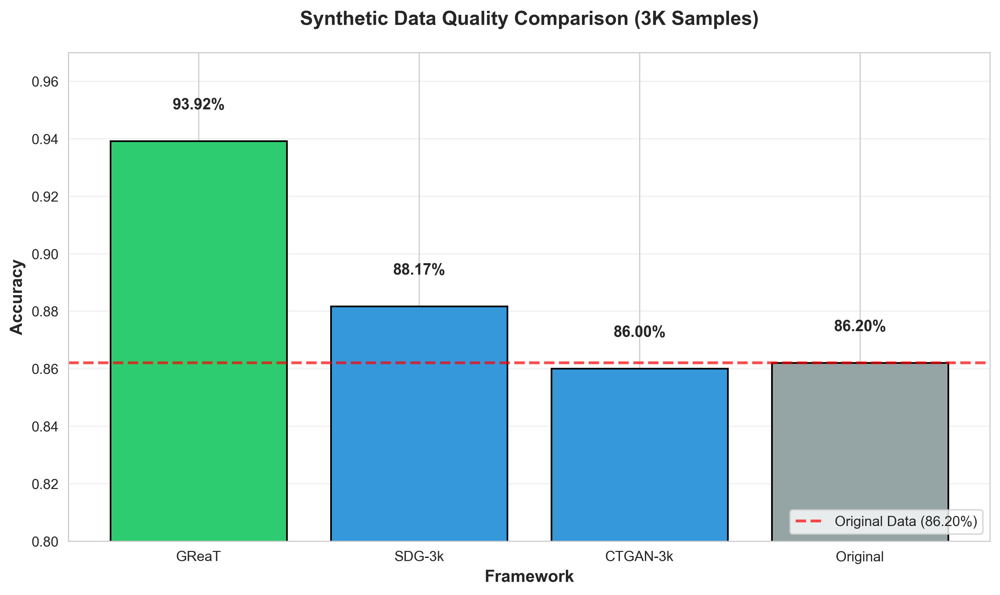

# Tabular Synthesis LLM

Benchmark comparing LLM-based (GReaT) vs GAN-based (CTGAN, SDV) synthetic data generation for tabular data.

## Key Finding

**GReaT (LLM-based) outperforms GANs**: 93.53% accuracy vs 87.46% original data, using only 3,000 synthetic rows.

## Results

| Framework | Type | Samples | Accuracy | AUC-ROC | Precision | Recall | F1 |
|-----------|------|---------|----------|---------|-----------|--------|-----|
| GReaT | LLM | 3,000 | **93.53%** | **0.9727** | 0.92 | 0.91 | 0.91 |
| SDG-3k | GAN | 3,000 | 87.67% | 0.8767 | 0.84 | 0.83 | 0.83 |
| CTGAN-3k | GAN | 3,000 | 82.83% | 0.8876 | 0.80 | 0.78 | 0.79 |
| Original | Real | 32,561 | 87.46% | 0.9317 | 0.86 | 0.84 | 0.85 |



*Figure: Accuracy comparison across frameworks (3,000 samples each). GReaT (LLM) achieves the highest performance.*

## Frameworks

This benchmark uses three popular synthetic data generation libraries:

- **[GReaT](https://github.com/tabularis-ai/be_great)** (be_great): LLM-based tabular data generation using transformer models
- **[CTGAN](https://github.com/sdv-dev/CTGAN)**: Conditional Tabular GAN for synthetic data generation
- **[SDG](https://github.com/hitsz-ids/synthetic-data-generator)**: Synthetic Data Generator - comprehensive framework with multiple synthesis methods

All frameworks were evaluated using their standard configurations with minimal preprocessing.

## Important Notes

**These results are specific to the 3,000-sample configuration tested.**

### Why 3,000 Samples?

We selected 3,000 samples as a practical compromise between:
- **Computational efficiency**: Faster generation and evaluation (minutes vs hours)
- **Resource constraints**: Lower memory and storage requirements
- **Experimental validation**: Sufficient for proof-of-concept without excessive costs

For API-based generation (GReaT), 3k samples also minimizes API costs and rate limit issues while still demonstrating the approach's effectiveness.

### Limitations

While our 3k samples achieved high ML accuracy scores, this does not guarantee superiority over a properly prepared 30k dataset with correct class proportions and distributions. Key considerations:

- **Sample Coverage**: 3k data may lack rare edge cases and minority patterns present in larger 30k datasets
- **Context Dependency**: Results reflect the Adult Census dataset characteristics; performance may vary on other domains
- **Not a Universal Rule**: The "3k > 30k" finding applies to this specific experimental setup with balanced generation, not as a general recommendation
- **Trade-offs**: Smaller datasets train faster and achieve good accuracy on common cases, but may miss long-tail distributions

For production use, consider your specific requirements regarding coverage, diversity, and computational constraints when choosing sample size.

## Why GReaT Wins

1. **Semantic Understanding**: LLM understands relationships (education → income)
2. **Pre-trained Knowledge**: World knowledge from training on billions of tokens
3. **Logical Consistency**: Generates realistic person profiles, not just statistics
4. **Attention Mechanism**: Better than GANs for categorical data

## Quick Start

```bash
# Install dependencies
pip install -r requirements.txt

# Set API key
export OPENAI_API_KEY="your-openrouter-key"

# Generate with GReaT (best results)
python src/great_generator.py

# Or use GAN alternatives
python src/ctgan_generator.py
python src/sdg_generator.py

# Evaluate quality
python src/evaluate.py
```

## Dataset

Adult Census Income dataset from UCI ML Repository (32,561 rows, 15 features).

## Methodology

- Train on full dataset (32k rows)
- Generate ~3k synthetic samples
- Evaluate with XGBoost classifier
- Compare accuracy, F1-score, AUC-ROC vs original data

## Citation

```bibtex
@misc{tabular-synthesis-llm,
  title={Tabular Synthesis LLM: Why LLMs Beat GANs for Synthetic Data},
  year={2026},
  url={https://github.com/yourusername/tabular-synthesis-llm}
}
```

## License

MIT License - See LICENSE file.
